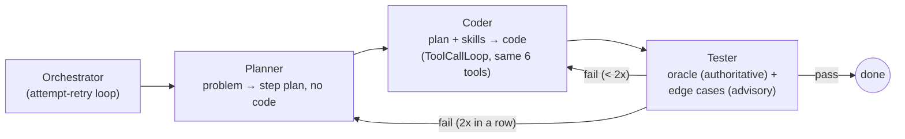
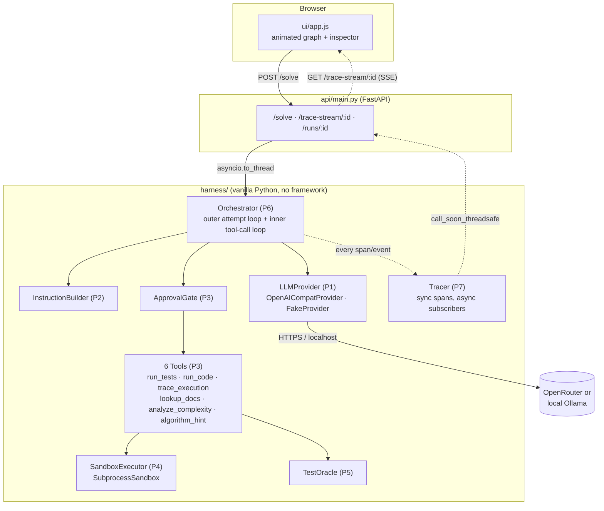
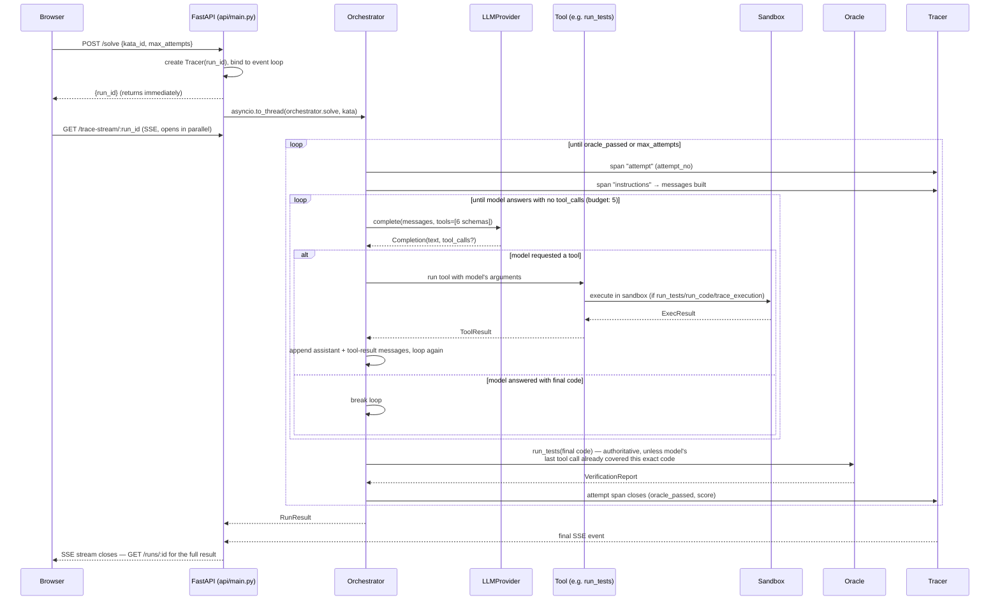

# Glassbox

**Agent = Model + Harness.** The model is a swappable commodity behind one interface (`LLMProvider`). Everything else — instructions, tools, sandbox, verification, orchestration, tracing, UI — is the harness, built by hand in vanilla Python so the whole thing is visible instead of a black box.

All 14 primitives from [`spec/HARNESS_PLAN.md`](spec/HARNESS_PLAN.md) are implemented. A single agent solves a coding kata end-to-end — read problem → write code → execute in a sandbox → verify against a deterministic oracle → retry on failure → report — **or** a Planner→Coder→Tester subagent team solves the same kata with structured failure feedback, a bounded context budget, on-demand skill loading, and cross-session memory. Every step is traced live to a browser UI over SSE, in either mode.

Full build plan: [`spec/HARNESS_PLAN.md`](spec/HARNESS_PLAN.md). Design decisions with rationale: [`DECISIONS.md`](DECISIONS.md).

## All 14 primitives

| # | Primitive | Phase | File |
|---|---|---|---|
| P1 | Provider seam | 1 | [`harness/providers/`](harness/providers/) |
| P2 | Instructions | 1 | [`harness/instructions.py`](harness/instructions.py) |
| P3 | Tools + approval gate | 1 | [`harness/tools/`](harness/tools/) |
| P4 | Sandbox | 1 | [`harness/sandbox/executor.py`](harness/sandbox/executor.py) |
| P5 | Verification (oracle) | 1 | [`harness/verification/oracle.py`](harness/verification/oracle.py) |
| P6 | Orchestration (single- and multi-agent) | 1 / 2 | [`harness/orchestrator.py`](harness/orchestrator.py), [`harness/orchestrator_multi.py`](harness/orchestrator_multi.py) |
| P7 | Tracing (full OTel-flavored conformance + cost) | 1 / 3 | [`harness/tracing/`](harness/tracing/), [`harness/costs.py`](harness/costs.py) |
| P8 | UI (a fixed flowchart with real loop-back edges + a narrated story feed + History dashboard) | 1 / 3 | [`ui/`](ui/) |
| P9 | History (per-session attempt state) | 2 | [`harness/context/history.py`](harness/context/history.py) |
| P10 | Context delivery (structured failure feedback) | 2 | [`harness/context/failure_formatter.py`](harness/context/failure_formatter.py) |
| P11 | Context management (trimming/compaction) | 2 | [`harness/context/context_manager.py`](harness/context/context_manager.py) |
| P12 | Subagents (planner / coder / tester) | 2 | [`harness/subagents/`](harness/subagents/), [`harness/tool_loop.py`](harness/tool_loop.py) |
| P13 | Skills (on-demand SKILL.md loading) | 3 | [`skills/`](skills/), [`harness/skills/loader.py`](harness/skills/loader.py) |
| P14 | Durable state + memory (cross-session attempt log + recall) | 3 | [`harness/memory/store.py`](harness/memory/store.py) |

`POST /solve {mode: "single" | "multi"}` picks which orchestrator runs — see [DECISIONS.md #9](DECISIONS.md) for why both exist rather than one replacing the other.

### Multi-agent flow (P12)



Each subagent call is a `tracer.span("subagent", ...)` carrying only a **distilled** `SubagentResult` (plan steps / code / verdict) back to the orchestrator — never the raw message transcript it used internally (see DECISIONS.md #9-#12 and the plan's explicit "#1 thing people get wrong with subagents" warning).

## System design

### Component architecture



**What's actually novel here** (worth leading with in an interview): the **Orchestrator is the only stateful piece**, and every primitive it calls is a thin, swappable, independently-testable class — `LLMProvider`, `SandboxExecutor`, and every `Tool` are ABCs with exactly one method each. Nothing imports a framework; `harness/` has zero dependency on FastAPI, so the entire agent logic is unit-testable (and *is* unit-tested — see `tests/`) without an HTTP server in the loop at all.

### Request lifecycle — one `/solve` call, in full

This is the sequence I'd actually draw on a whiteboard. It covers both loops: the **outer** attempt-retry loop (Decision: oracle precedence) and the **inner** tool-call loop (the newer function-calling addition).



### Concurrency model — the one genuinely tricky part

`Orchestrator.solve()` is **synchronous** (blocking HTTP calls to the LLM, blocking `subprocess.run` for the sandbox) and runs inside `asyncio.to_thread(...)`, off the event loop. Meanwhile the SSE stream (`GET /trace-stream/:id`) is **async**, living on the event loop, in a *different* task than the one running the orchestrator's thread.

`Tracer` is the bridge. Every `span()`/`event()` call happens synchronously, on the orchestrator's worker thread — but the SSE subscribers are `asyncio.Queue`s that only the event loop can safely push into. `Tracer.bind_loop()` stashes a reference to the event loop at run start, and every emission goes through `loop.call_soon_threadsafe(queue.put_nowait, event)` — the one call in this codebase that's actually about thread safety rather than business logic. Skip it and the UI would either deadlock or silently drop events depending on timing.

A second, smaller wrinkle: a **new** SSE connection to an **already-finished** run still works, because `Tracer.subscribe()` replays `self._events` (the full history) before switching to live delivery — that's what let me debug a real production incident by reconnecting to a completed run's trace stream and reading back the exact payload that was sent to the LLM right before it failed, without reproducing anything.

## The harness visualizer

The UI (`ui/`) is the point of the project: **one fixed flowchart, drawn once per run**, not redrawn per attempt. Two earlier designs both got this wrong — a ring around a central model core made every attempt retrace the same positions (no way to tell which retry was live), and a "one row per attempt" list flattened the loop structure into repeated boxes instead of showing it as a loop. The current design draws the harness as a real flowchart with real loop-back edges: a purple arrow carries the packet from Oracle back up to the top on a retry, a blue arrow carries it from Tester straight back to Coder on a same-plan retry (no replan), and an amber arrow carries it from wherever the model is being asked again (a tool-calling round, the Tester's edge-case sweep) back up to Provider. Each loop edge has a live counter badge (`retry ×2`, `same-plan retry ×1`, `model asked again ×3`) instead of a separate node per occurrence. Alongside the flowchart, the **Story** panel narrates the run in plain English ("Retrying — attempt 2, with the previous failure fed back into the prompt", "Tester ran the official oracle — every case passed") instead of a raw event log — the goal is that a stranger can watch a small quantized model solve a hard problem and understand *why* it worked: which mistake the harness caught, what feedback it gave, and how many tries it took. The narration is grouped by attempt (current expanded, past collapsed), and the full raw trace is still one click away per attempt via a "show raw trace" toggle. Every node/edge/story-line is instrumented by the Tracer (P7) and streamed to the page over SSE; click-to-inspect on any node shows every real call to that primitive across the whole run, most recent first, each labeled with which attempt it happened in.

## Run locally

```bash
python3 -m venv .venv
source .venv/bin/activate
pip install -e ".[dev]"

# No API key needed — falls back to a scripted FakeProvider automatically.
uvicorn api.main:app --reload --port 8000
# open http://127.0.0.1:8000/ui/index.html
```

To watch the safety-retry visual without a live key, also set `GLASSBOX_SIMULATE_SAFETY=1` (see item 2 below).

### Using a real OpenRouter model (items 1 & 2)

**A single `OPENROUTER_API_KEY` is all you need** — copy `.env.example` to `.env`, set the key (free at openrouter.ai), and launch with uvicorn's `--env-file`:

```bash
uvicorn api.main:app --env-file .env --reload --port 8000
```

(`--env-file` works because `uvicorn[standard]` bundles python-dotenv — no `export` needed.) The only required header is `Authorization: Bearer <key>`; OpenRouter routes the request to the configured free model (`OPENROUTER_MODEL`, default `meta-llama/llama-3.3-70b-instruct:free`). The `HTTP-Referer`/`X-Title` headers we send are optional ranking metadata, not auth.

**Free-tier rate limits:** OpenRouter's `:free` models are aggressively throttled and share a per-account daily cap (roughly 50 requests/day under $10 of credits, higher above). A `429 Too Many Requests` means the key authenticated fine but you've hit that cap — wait for the reset, switch `OPENROUTER_MODEL` to another `:free` model, or add a little credit. The provider rides out brief 429s automatically (honors `Retry-After`, exponential backoff, `max_transient_retries=4`), but it can't beat a hard daily quota.

OpenRouter sometimes routes a free request to a **moderation/safety model**, which answers with a bare verdict like `User Safety: safe` instead of solving the kata. `OpenAICompatProvider` detects that response shape and **re-issues the call** (up to `max_safety_retries`, default 3) so the request lands on a real model. The number of re-routes is counted on `Completion.safety_retries`, surfaced as a `safety_retries` span attribute, and shown in both the live trace ("safety-retry ×N — re-routed past the moderation model") and the per-attempt result card. See [`harness/providers/openai_compat.py`](harness/providers/openai_compat.py) and [`tests/test_provider_safety.py`](tests/test_provider_safety.py).

(`.env` isn't auto-loaded — export the vars, or use your shell's env loader — kept dependency-light for Phase 1.)

Run tests:

```bash
pytest tests/ -v
```

In the UI, the **mode selector** next to the kata picker redraws the flowchart's node sequence: `single agent` shows Orchestrator→Instructions→Provider→Approval→Tools→Sandbox→Oracle (Phase 1), `multi agent (planner/coder/tester)` shows Planner→Coder→Provider→Approval→Tools→Sandbox→Tester→Oracle instead — Provider/Approval/Tools/Sandbox/Oracle land at the exact same y-position in both layouts, since they're genuinely shared substrate both flows call through. The **History** tab reads `GET /stats` + `GET /history`, backed by the SQLite store at `data/glassbox.db` (gitignored — created on first run).

## The retry story

`binary_search` is the kata most likely to need a second attempt (classic off-by-one). With `FakeProvider` this is scripted deterministically: attempt 1 uses `<` in the loop condition (misses the last element), attempt 2 fixes it to `<=`. Pick "Binary Search" in the UI and click Solve to watch it fail then pass, with the structured failure (`expected 5 got -1`) visibly fed back into attempt 2's prompt.

## Sandbox limits — honestly

`SubprocessSandbox` runs submissions as a fresh `python3` subprocess with `resource.setrlimit` for CPU time and address space, plus a hard wall-clock `timeout` that kills the process if it hangs. This is **not** a hermetic security boundary — it shares the host filesystem and kernel, and `RLIMIT_AS` isn't reliably enforced on macOS (verified in `tests/test_sandbox.py`, where the wall-clock timeout is what actually catches an unbounded-memory loop in practice on this dev machine). It's adequate for running a curated, fixed set of katas with no user-supplied problems (see Decision #2) and for demoing the "sandbox kills bad code" story — it is not adequate for running arbitrary untrusted code from the public internet unmodified. `DockerSandbox` (same `SandboxExecutor` interface, container isolation) is the intended upgrade path, deferred past Phase 1.

## Katas

Six, in [`harness/verification/katas/`](harness/verification/katas/): `reverse_string` (warm-up), `fizzbuzz_variant` (custom rules, not the classic — a model can't pattern-match its way through), `binary_search` (off-by-one trap, the scripted retry demo under `FakeProvider`), `balanced_brackets` (stack logic), `merge_intervals` (sorting + edge cases), `regex_matching` (LeetCode #10 — hard; `.`/`*` backtracking-DP boundary conditions are genuinely easy for a small local model to get wrong on the first try, so it's the best kata for watching a *real* retry against a live provider like Ollama). All oracles are pure `expected == actual` — no katas with multiple valid outputs, per plan §3.4.

## Deployment

Not yet deployed — the plan's exit criteria for both phases include a Railway/Vercel deploy; this covers the local build for Phase 1 through Phase 3, verified end-to-end in a browser preview (single-agent run, multi-agent run with the escalation/skill/memory story, and the History dashboard). `api/main.py` serves both the FastAPI backend and the static UI (`/ui`) from one process, which fits a single Railway service. Durable memory (P14) is SQLite on local disk — Railway's disk is ephemeral, so a real deploy needs the Postgres/Supabase swap noted as explicitly out of scope in [DECISIONS.md #15](DECISIONS.md).

## What's honestly reduced scope in this pass

- **Deployment.** Everything above runs and is verified locally; no Railway/Vercel/Supabase deploy yet (see above).
- **P14 is SQLite only** (Phase 3a). Postgres/Supabase (3b) isn't done.
- **Skill/memory events have no dedicated flowchart node.** `skill_loaded`, `memory_write`, and `memory_recall` (P13/P14) narrate in the Story panel with full attrs on click, same as every other event, but don't get their own animated node the way Planner/Coder/Tester do.
